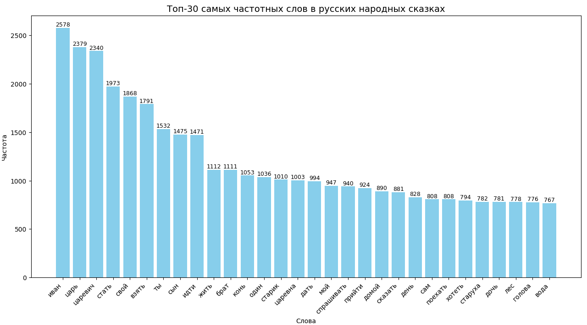
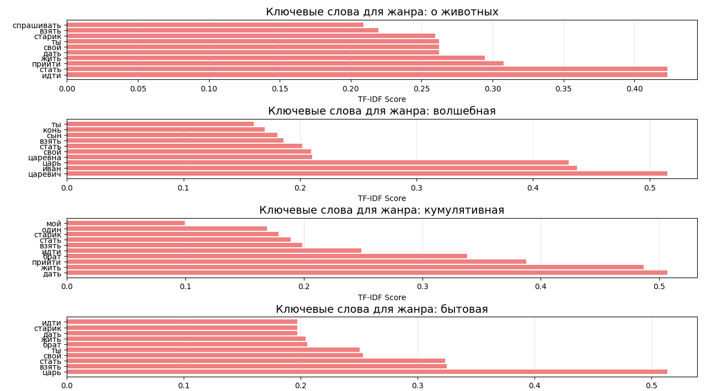
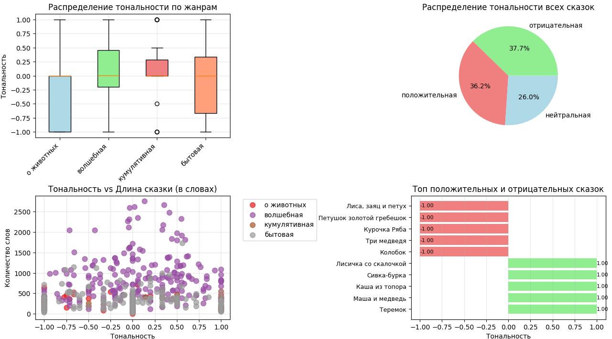
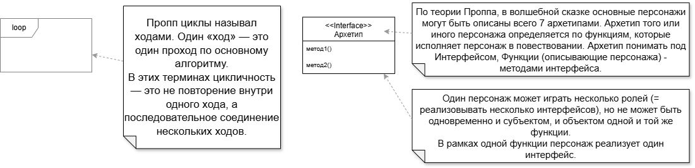
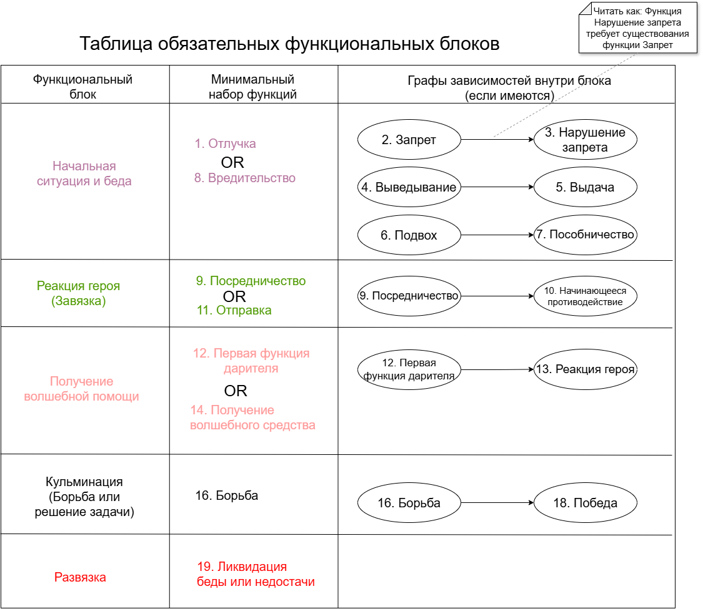
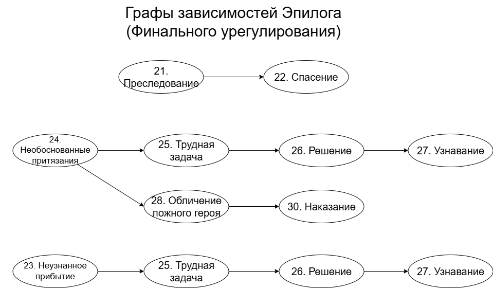
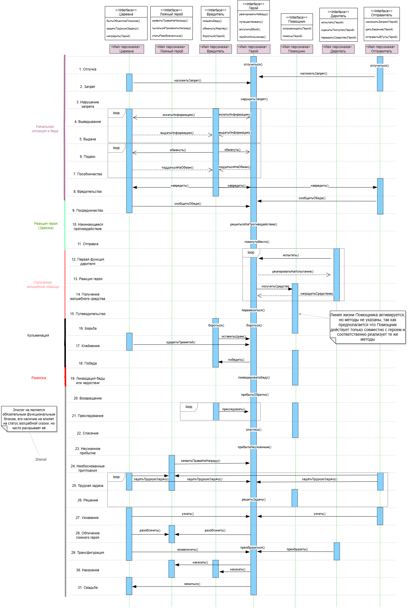

# Анализ русских народных сказок: корпусное исследование и формализация по Проппу

[](https://python.org)
[](https://pandas.pydata.org)
[](https://scikit-learn.org)
[](https://www.uml.org/)
[](https://en.wikipedia.org/wiki/Dependency_graph)

> Работа сочетает **количественный анализ фольклорного корпуса** (550 сказок, 4 жанра) и **структурное моделирование** волшебной сказки по В.Я. Проппу.  

---

## Оглавление
1. [Анализ корпуса из 550 сказок](#1-анализ-корпуса-из-550-сказок)  
   - Данные и предобработка  
   - Анализ и ключевые выводы
   - Ссылка на полную статью  
2. [Анализ волшебной сказки по Проппу](#2-анализ-волшебной-сказки-по-проппу)  
   - Формальные критерии  
   - Обозначения и описание функций 
   - Обязательные функциональные блоки
   - Граф зависимостей функций эпилога  
3. [Как воспроизвести](#как-воспроизвести)  

---

## 1. Анализ корпуса из 550 сказок
В рамках исследования были проведены самостоятельный сбор датасета из 550 сказок (с ручной разметкой), очистка текста, лемматизация, TF‑IDF, анализ тональности и их визуализация.
### Данные и предобработка

- **550 русских народных сказок** по сборнику А.Н. Афанасьева.
- **Ручная жанровая разметка**, указание персонажей, длины сказки и темы.
- Предобработка:  
  - токенизация (nltk)  
  - лемматизация (pymorphy2)  
  - удаление стоп-слов и пунктуации  
  - приведение к нижнему регистру  

В результате был получен структурированный DataFrame с рядом колонок.

### Анализ
Проведён частотный анализ, лексическое ядро сказки – **глаголы действия и речи** + **социальная иерархия** (царь, царевич). Это коррелирует с функциями Проппа («отлучка», «испытание», «перемещение»).
На долю глаголов действия и речи приходится 36.9% всех словоупотреблений, существительные составляют 45.5%, а средняя длина сказки – 530 слов, диапазон от 20 до 2757 слов.


Для каждого жанра выделены слова с максимальной специфичностью - жанровые ключевые слова (TF-IDF).



Кроме того, использован словарный метод (позитивные/негативные слова, адаптированные для архаичной лексики).  




### Полная статья

Подробное описание методологии, всех графиков и лингвистической интерпретации представлено в научной статье:  
📄 [`reports/article/article.pdf`](reports/article/article.pdf)

---

## 2. Анализ волшебной сказки по Проппу

Вторая часть проекта – **формализация морфологии волшебной сказки** на основе работы В.Я. Проппа «Морфология сказки» (1928).  
Целью был вывод **объективных критериев**, позволяющих отнести текст к жанру волшебной сказки.

### Формальные критерии

В результате анализа структуры 31 функции и их взаимосвязей я сформулировала **три ключевых условия**:

1. **Строгий порядок функций** (с возможными пропусками и циклами)  
   Функции в волшебной сказке следуют в заданной последовательности. Некоторые функции могут отсутствовать, если это не нарушает граф зависимостей (например, функция «отлучка» может быть пропущена, если за ней сразу идёт «запрет»). Допустимы циклы (повторение блоков).

2. **Наличие обязательных функциональных блоков**  
   Существует минимальный набор функций, без которых сказка не может считаться волшебной. Этот набор определён на основе анализа ядра сюжета (например, функции «вредительство» → «отправка героя» → «победа»).

3. **Персонажи как интерфейсы**  
   Каждый персонаж в ключевых событиях реализует определённую **роль (интерфейс)** – герой, даритель, антагонист, помощник и т.д. Один персонаж может на протяжении сказки реализовывать несколько разных интерфейсов (например, Баба-Яга сначала вредитель, потом даритель).

Любая сказка, которая проходит проверку по критерием, может называться волшебной по В.Я.Проппу. С другой стороны, любая классическая народная сказка жанра "волшебная" обязательно проходит проверку.


### Обозначения и описание функций

Для удобства анализа также введены обозначения - объяснение, почему те или иные элементы нотации UML использованы в рамках данного анализа,



и краткие описания функций по В.Я.Проппу

| Функция | Описание |
|---------|----------|
| **1. Отлучка** | Кто-то из членов семьи покидает дом. Создаётся условие для будущей беды. |
| **2. Запрет** | Герою что-то строго запрещают делать. Запрет всегда связан с будущей опасностью. |
| **3. Нарушение запрета** | Герой нарушает запрет. |
| **4. Выведывание** | Вредитель намеренно ищет информацию для нанесения вреда жертве. |
| **5. Выдача** | Вредитель получает нужную информацию. |
| **6. Подвох** | Вредитель пытается обмануть жертву, чтобы завладеть ею или её знаниями или имуществом. |
| **7. Пособничество** | Жертва поддаётся на обман и тем самым помогает вредителю. |
| **8. Вредительство** | Вредитель наносит вред (похищает, убивает, заколдовывает). |
| **9. Посредничество** | О беде сообщают герою или герой сам узнаёт о ней. |
| **10. Начинающееся противодействие** | Герой решается на противодействие (вернуть, возродить, расколдовать, спасти). |
| **11. Отправка** | Герой покидает дом. |
| **12. Первая функция дарителя** | Герой встречает дарителя, который испытывает его (спрашивает, кормит, нападает). |
| **13. Реакция героя** | Герой выдерживает испытание или нет (отвечает вежливо, помогает, угощается, побеждает в схватке). |
| **14. Получение волшебного средства** | В распоряжение героя попадает волшебное средство или помощник. |
| **15. Путеводительство** | Герой переносится, доставляется к своей цели. |
| **16. Борьба** | Герой и вредитель вступают в схватку. Она может быть открытой или скрытой. |
| **17. Клеймение** | Героя метят (наносят рану, он получает отметину, его целует царевна и он преображается). |
| **18. Победа** | Вредитель побеждается (убит, изгнан, лишён какого-либо блага, его план сломлен). |
| **19. Ликвидация беды или недостачи** | Начальная проблема устраняется. |
| **20. Возвращение** | Герой возвращается домой. |
| **21. Преследование** | Героя преследуют. |
| **22. Спасение** | Герой спасается от преследования. |
| **23. Неузнанное прибытие** | Герой неузнанным прибывает домой (под видом нищего, слуги, просто неузнанный). |
| **24. Необоснованные притязания** | Ложный герой предъявляет права на награду. |
| **25. Трудная задача** | Герою и/или ложному герою предлагается трудная задача. |
| **26. Решение** | Задача решается. |
| **27. Узнавание** | Героя узнают по клейму или после решения задачи. |
| **28. Обличение ложного героя** | Ложный герой изобличается. |
| **29. Трансфигурация** | Герой получает новый облик (становится красавцем, надевает царское платье, превращается из зверя в человека). |
| **30. Наказание** | Ложный герой или вредитель наказывается (убит, изгнан). |
| **31. Свадьба** | Герой женится на царевне. |
---

### Обязательные функциональные блоки

Выделено 5 блоков, которые встречаются во всех волшебных сказках:

- **Начальная ситуация и беда** (функции 1-8)
- **Реакция героя (Завязка)** (функции 9-11)
- **Получение волшебной помощи** (функции 12-15)
- **Кульминация** (функции 16-18)
- **Развязка** (функция 19)
Кроме того указаны зависимости, которые отображают, какие функции не могут существовать без других.



### Граф зависимостей функций эпилога

Помимо пяти обязательных функциональных блоков выделен **Эпилог** (функции 20-31). Его наличие не влияет на статус волшебной сказки, но часто раскрывает её.
На схеме показаны существующие зависимости между его функциями.



### Диаграмма последовательностей

Главный артефакт - диаграмма последовательностей - показывает, как функции накладываются на сюжетные точки. Здесь собраны все 7 героев-архетипов по В.Я.Проппу, а также его 31 функция, и отображены в общей системе.




## 3. Как воспроизвести
Первую часть исследования можно провести самостоятельно.
1. **Клонировать репозиторий**  
2. **Установить зависимости**
```
pip install -r requirements.txt
```
3. **Запустить анализ датасета** - частотный, ключевой или тональный (`frequency_analysis.py`, `keyness_analysis.py`, `sentiment_analysis.py`)

## Автор

**Лена** - [GitHub](https://github.com/monalenka)